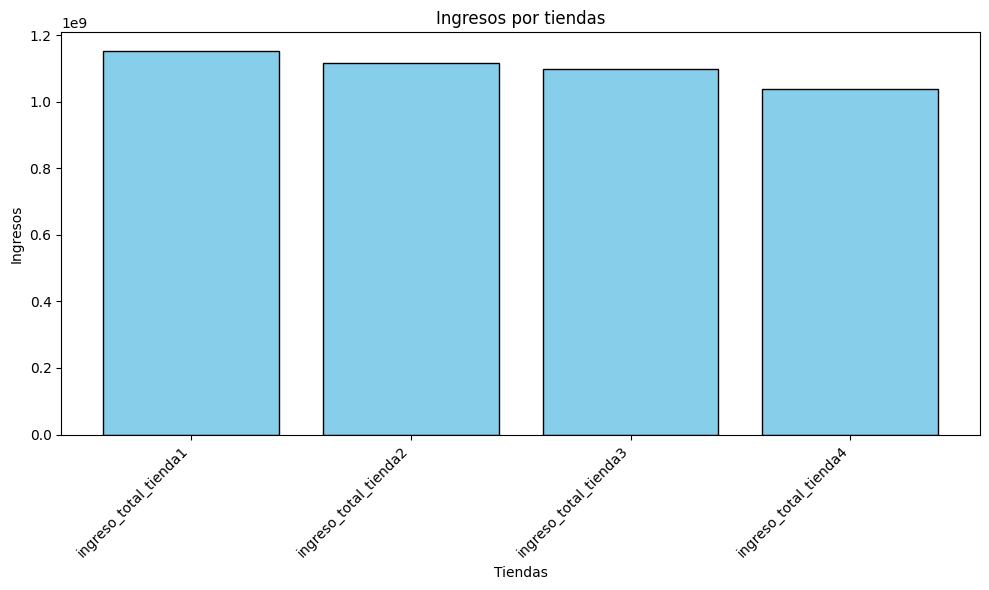
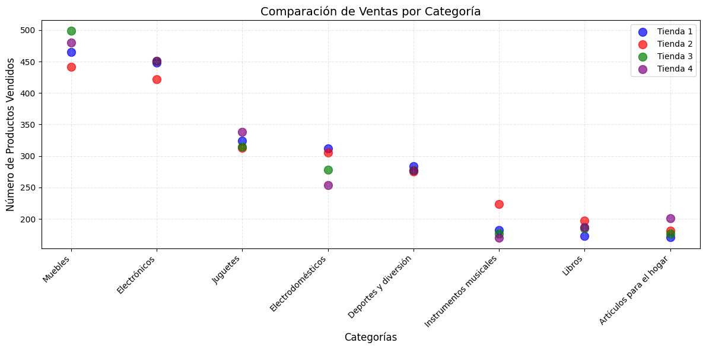
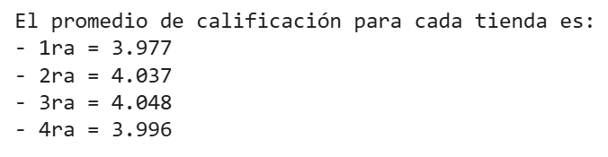
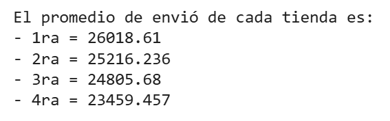

# Data-Science-Challenge-01
Primer desafío de ciencia de datos enfocado en el análisis de ventas y rendimientos de tiendas. 

# Objetivo:

El objetivo es ayudar al Señor Juan a decidir qué tienda, de las 4, vender para invertir en un nuevo negocio.

Hacer una evaluación considerando lo siguiente:

- Facturación total de cada tienda.
- Categorías más populares.
- Promedio de calificación de los clientes.
- Productos más y menos vendidos.
- Costo promedio del envío. 

# Estructura de datos:
El conjunto de datos incluye la siguiente información:

- **Producto y Categoría:** Artículos vendidos y sus calificaciones.
- **Precio y Envío:** Valores de venta y costos asociados.
- **Fecha y ubicación de compra:** Información temporal y geográfica.
- **Evaluación de compra:** Comentarios de clientes.
- **Tipo de Pago y Cuotas:** Métodos utilizados por los clientes.
- **Coordenadas Geográficas:** Ubicación de las transacciones.

# Pasos:
- Cargar y manipular datos CSV con la biblioteca Pandas.
- Crear visualizaciones de datos con la biblioteca Matplotlib.
- Analizar métricas como ingresos, reseñas y rendimiento de ventas.

---
---

<h1 align="center"> Informe Final: Recomendación de tienda para el Sr. Juan </h1>

### Introducción

El presente análisis tiene como propósito evaluar el desempeño de cuatro tiendas con el objetivo de determinar cuál de ellas es la más conveniente para que el Sr. Juan pueda vender sus productos. Para ello, se han analizado múltiples variables clave como los ingresos totales, el comportamiento por categoría de producto, la satisfacción del cliente (medida por calificaciones), los productos más y menos vendidos y el costo promedio de envío. El análisis se desarrolló a partir de datos reales y se visualizó con herramientas gráficas para respaldar las conclusiones obtenidas.

---

### Desarrollo

#### 1. Ingresos totales

La tienda con mayores ingresos es **Tienda 1**, seguida de cerca por las tiendas 2 y 3. La **Tienda 4 presenta los ingresos más bajos**, con una diferencia significativa de **\$112,504,700** en comparación con la Tienda 1. Esta diferencia en facturación es un primer indicador del menor rendimiento económico de la Tienda 4.

#### 2. Categorías más y menos vendidas

En términos generales, las tiendas comparten una distribución similar de ventas por categoría. Sin embargo, **la Tienda 4 tiene un rendimiento bajo en la categoría “Electrodomésticos”**, la cual representa una de las más rentables. Esto limita su potencial de crecimiento. En contraste, las tiendas 1, 2 y 3 tienen una participación más equilibrada y estable en esta categoría.

#### 3. Calificaciones promedio

Las calificaciones son un reflejo de la experiencia del cliente. En este aspecto:

* **Tienda 1** y **Tienda 3** tienen las **mejores calificaciones promedio**,
* mientras que **Tienda 4** presenta una calificación más baja,
  lo que puede sugerir problemas de atención al cliente o calidad del servicio.

#### 4. Productos más y menos vendidos

Los productos más vendidos coinciden entre la mayoría de tiendas, pero **Tienda 4 tiene menor rotación de productos en comparación con las demás**, lo cual afecta directamente sus ingresos y refleja una menor preferencia por parte de los clientes. Esto también influye negativamente en su capacidad de competir en el mercado.

#### 5. Coste de envío promedio

En relación al costo de envío, **la Tienda 1 presenta los costos de envío más elevados**, mientras que Tienda 4 tiene un **costo de envío más bajo** en promedio. Esto puede indicar directamente la decisión de compra de los usuarios.

---

### Conclusión

Después de revisar los indicadores clave, **la Tienda 4 es la opción más recomendable para que el Sr. Juan lo venda**. Esta tienda destaca por:

* Ser la de **menores ingresos**,
* Tener una **menor rotación de productos**,
* Mantener **bjs calificaciones por parte de los clientes**,
* Y presentar un **costo de envío bajo**.

---
---